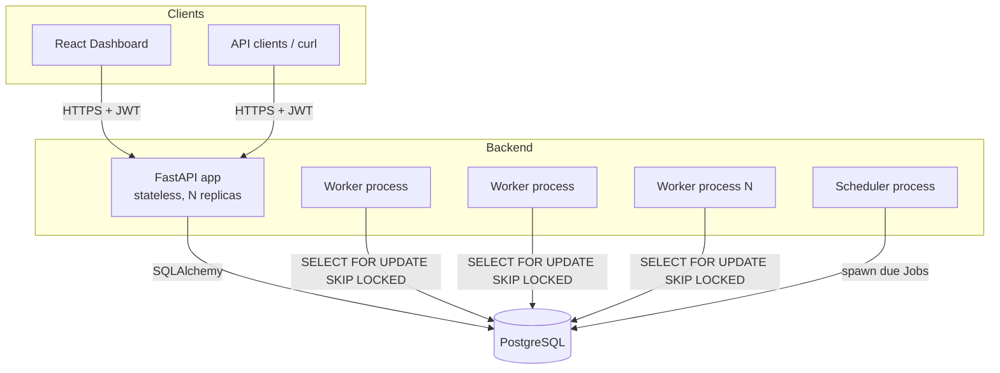
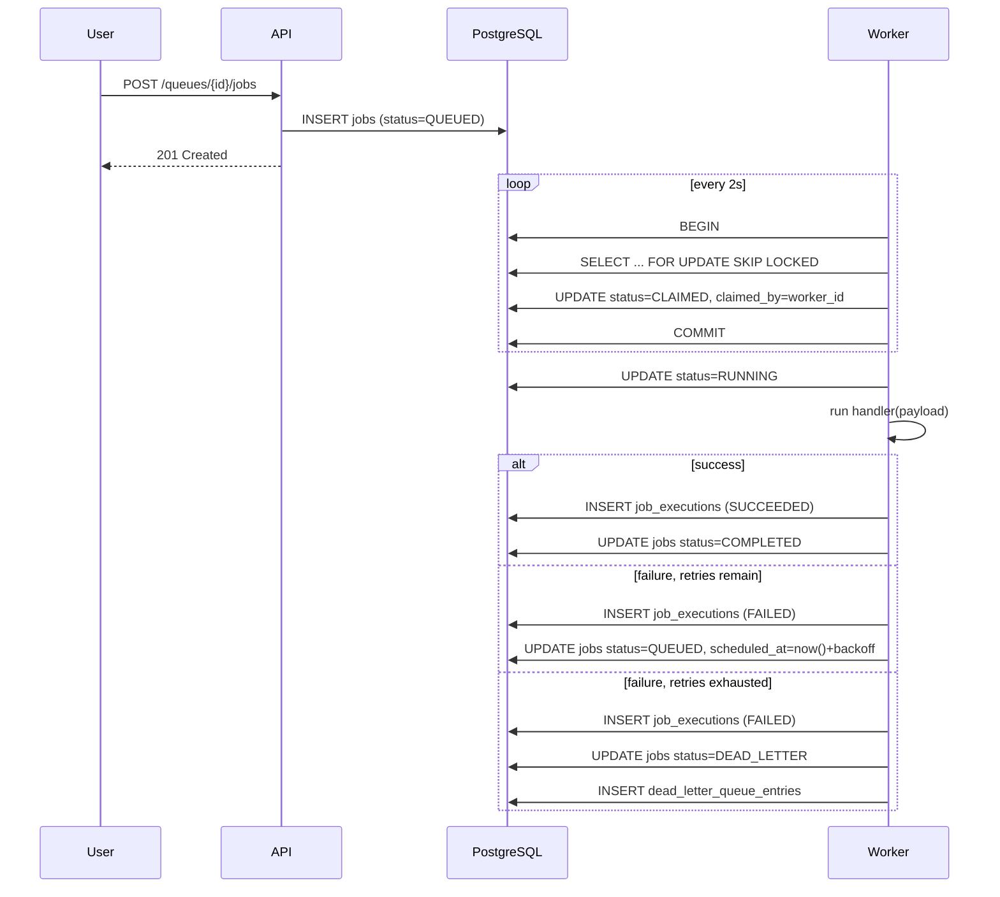
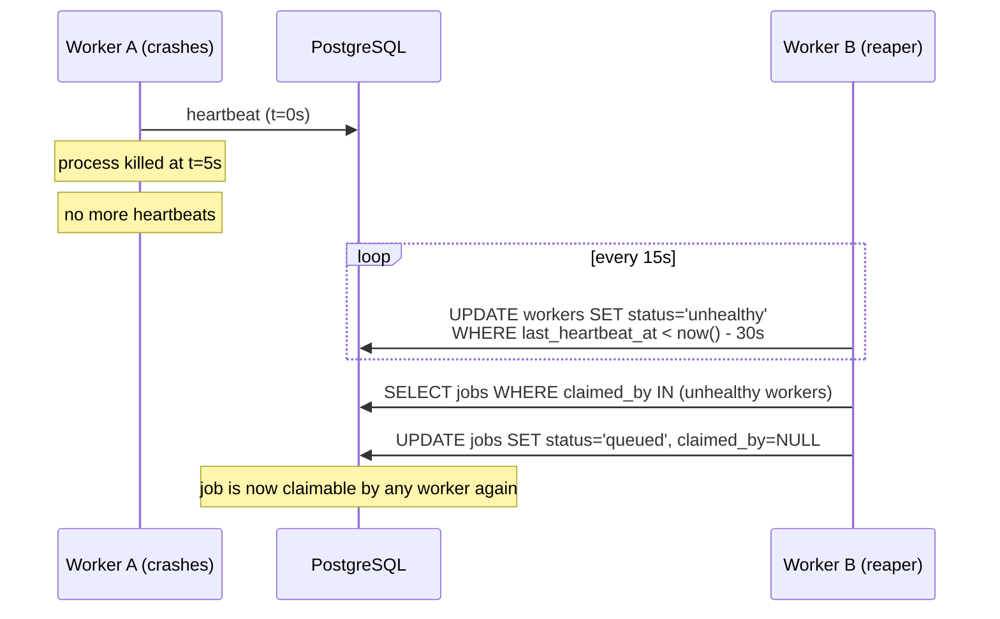

# Architecture

## System overview

The system is four independently deployable processes sharing one
PostgreSQL database, which is also the coordination mechanism between
them — there's no separate message broker or lock service.

## Why this shape

**The API never touches job execution.** `POST /queues/{id}/jobs` just
inserts a row with `status=QUEUED`. It has no idea when or by which
worker that job will run. This decoupling is what lets workers scale
independently of API traffic, and it's why the API can stay fully
stateless (any replica can serve any request).

**Workers are dumb pollers, on purpose.** Each worker's loop is: send a
heartbeat, try to claim jobs, run whatever it claimed, repeat. There's
no leader election, no worker-to-worker communication, no shared
in-memory state. All coordination between workers happens through
short, atomic Postgres transactions (see `job_repository.claim_jobs`).
This is simple to reason about and correct under crashes: a worker that
dies mid-poll just... stops running its loop. Nothing else needs to
know it existed until its heartbeat goes stale.

**The scheduler is separate from workers**, even though it's also a
polling loop, because it does a fundamentally different job: workers
*consume* the job queue, the scheduler *produces* new jobs onto it (by
turning cron templates into `Job` rows). Merging them would mean every
worker replica also re-evaluates every cron template on every poll —
wasteful, and it complicates reasoning about "did this cron job already
fire this minute" once you have N workers instead of 1.

## Request lifecycle: submitting and running a job

## Crash recovery

Every worker runs this recovery check on its own timer (every 15s by
default), so it doesn't depend on any single "coordinator" process
being alive — if the whole fleet restarts, whichever worker comes up
first will run the check.

## Deployment topology (docker-compose)

- `db` — PostgreSQL 16
- `api` — FastAPI, stateless, horizontally scalable
- `worker` — scalable independently (`docker compose up --scale worker=N`)
- `scheduler` — normally 1 replica; safe to run more (its due-template
  query also uses `SKIP LOCKED`), just unnecessary at small scale
- `frontend` — Vite dev server (a real deployment would build static
  assets and serve them from a CDN/static host instead)
